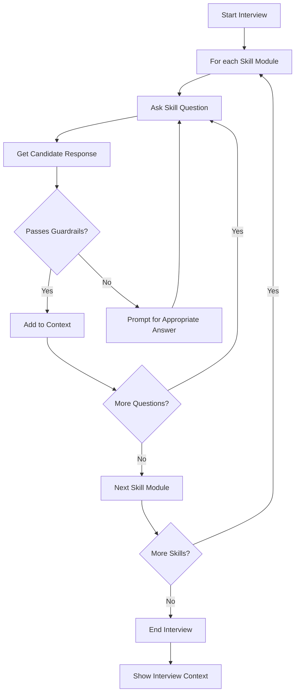

#  Interviewer Agent

This project implements a scalable  interviewer agent for assessing skills in Python, PySpark, SQL, and Kubernetes. The agent uses modular skill modules, guardrails for safe interactions, and context management to track the interview process.

## Features
- **Skill Modules:** Easily add or modify skill-specific questions.
- **Guardrails:** Prevents inappropriate or empty responses.
- **Context Management:** Tracks all questions and answers for review.
- **Scalable Design:** Add new skills or guardrails with minimal changes.

## Flow Chart



## Usage

1. Run the script:
   ```bash
   python crewai_interviewer.py
   ```
2. Answer the questions for each skill.
3. Review the interview context at the end.

## Requirements
- Python 3.7+

## Extending
- Add new skills by creating new `SkillModule` instances with questions.
- Enhance guardrails in the `Guardrails` class.

---

Feel free to customize the questions and guardrails as needed for your use case.

---

